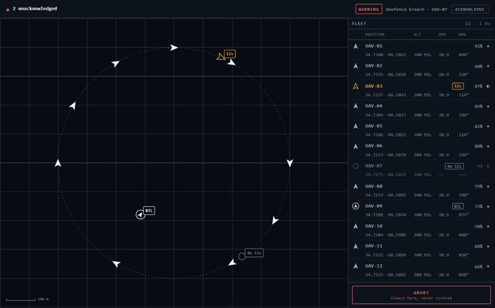
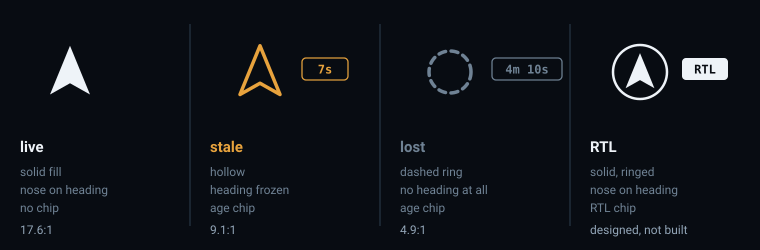
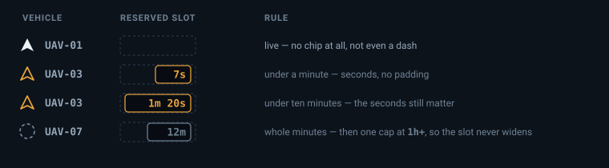

# console-design.md

The console's visual state language, its layout at twelve vehicles, and its alert surfacing
rules — decided on paper, once, before any of them are implemented.

This is a working note, not a design system. It exists because "visually distinct" in
MCS-003 is a decision someone has to make, and a decision made while implementing at the end
of a long day is how a console ends up with three different greys meaning three different
things. It was written in a day, deliberately.

It designs more than is built. Live, stale and lost are on screen; return-to-launch, alerts
and conflict rendering are designed here and rendered when the features behind them exist.
Designing half a language now and the other half later is how you get two languages.

**The working drawing is `console-design/mockup.html`**, committed beside this file. It is a
single static page with no build step — open it with `file://` — and it runs the layout below
at twelve, on the circuit the station's feed flew when this was drawn, with the ages ticking. Everything in
§1 and §2 was checked against it rather than asserted, and the two findings at the end of this
note came out of it. Where the two disagree, the note is wrong and gets fixed.

Two id shapes appear here and they are not the same thing: **`MCS-001`** and friends are
requirements; **`UAV-01`** and friends are vehicles, named the way the feed that flew when this
was written named them. The station now names a MAVLink vehicle after its system id — system 1
is `MAV-001` — and nothing in the state language depends on either shape. The station is MCS;
the aircraft are not.

**Date:** 2026-08-11

---

## 1. The screen at twelve

Drawn full. A layout that is calm with two demo vehicles and a scrolling wall with twelve is
a layout that has not been designed, and the operator's question is *"which one needs me,"*
never *"what is vehicle 7's battery."*



The whole language in one frame. Alert bar across the top, outside everything that scrolls;
the map with the fleet's circuit drawn under the markers; twelve rows and the abort control on
the right, no scrollbar. **UAV-03 is stale** — a hollow amber dart, frozen where it stopped,
carrying a `12s` chip on the map and in its row. **UAV-07 is lost** — a dashed ring with no
heading at all, `4m 12s`, and dashes where its speed and heading used to be. **UAV-09 has been
recalled** and is inside the circuit, a solid dart enclosed in a ring, chipped `RTL`. The other
nine are live, and every one of them lies tangent to the route line.

Taken from `console-design/mockup.html?bare`, which pins the clock, so the same picture comes
back every time rather than whatever the page happened to be showing.

**The panel is sized so twelve rows fit without scrolling.** That is the load-bearing
constraint of the whole layout: a panel that scrolls at twelve is a panel where the vehicle
that needs you is off-screen, which is HAZ-01 wearing a different hat. At the minimum
supported viewport of 1280×800, in full:

```
   48   alert bar
   28   panel header
   21   column labels
  624   twelve rows at 52
   56   the abort block
  ----
  777   of 800 — 23 spare
```

Every term is written out because the first pass of this note did not write them out: it
sized the rows at 56 px, counted the rows and the two headers, forgot the abort block, and
came to a confident 748. Built, it was 25 px over the viewport it claimed to fit, the panel
scrolled, and the thing hanging off the bottom edge was **abort** — the one control §6 says
may never be unreachable. A layout that fails by clipping its own emergency stop is worth
the twenty minutes it took to draw. Hence 52 px rows rather than 56, and hence the
arithmetic spelled out where the next person can check it.

If a thirteenth vehicle were ever admitted the panel would scroll — it cannot be, and the
store rejects it, which is the same bound arriving from the other side.

**Two lines per row, all six fields, always.** MCS-001 requires position, altitude, ground
speed, heading, battery and link status *for each connected vehicle*, and a row that hides
four of them behind an expander is not displaying them. The alternative considered and
rejected was a collapsed row that expands on selection: quieter at twelve, but it makes
MCS-001 depend on where the operator last clicked, and a requirement satisfied only for the
selected vehicle is not satisfied.

*"A healthy vehicle contributes very little"* is therefore a typographic job rather than a
hiding job. Line one is airy and carries the state badge, the id, the battery and the link
dot; line two carries the numbers, at low contrast. The eye is pulled by luminance, not by
reading — which is exactly what §2's palette is built to do.

**Every numeric column has a reserved width, and the numerals are tabular.** At twelve
vehicles reporting at 1 Hz a proportional digit is twelve columns of jitter per second, and
a display that shimmers is one an operator learns to stop looking at.

**Rows stay in stable vehicle-id order.** Sorting by attention — lost, then stale, then live
— was drawn and rejected: it puts the most urgent thing at the top exactly once, and
thereafter means the row you are reaching for moves while you reach for it. Attention is the
alert bar's job (§4). The panel's job is to be in the same place every time.

### Markers on the map

No clustering. Clustering hides the thing you need at the density where you need it, and at
this scale — a few hundred metres over a fixed origin — twelve aircraft are a legible
scatter, not a heap. Overlap is handled two ways instead: the marker keeps the
background-coloured outline it already has, which is what makes one dart readable where it
crosses another, and **markers are z-ordered by confidence** — live above stale above lost.
A live vehicle is never obscured by the ring of one that stopped reporting ten minutes ago.

---

## 2. The state language

Four states. Each one differs from the others in **at least two channels**, and never in
colour alone: around one man in twelve has some colour vision deficiency, and a screenshot
pasted into a report or printed in greyscale loses hue entirely, for everyone.

| | shape | fill | colour | text |
| --- | --- | --- | --- | --- |
| **live** | dart, nose on reported heading | solid | `#eef3f8` · 17.6:1 | none |
| **stale** | dart, heading frozen where it stopped | hollow, solid outline | `#e8a33d` · 9.1:1 | age |
| **lost** | ring — **no heading at all** | hollow, dashed outline | `#6f8294` · 4.9:1 | age |
| **RTL** | dart inside a solid ring | solid | live's fill | `RTL` |



Ratios are against the map background `#080c12`, measured. The panel surface is `#0d131b`,
1.05:1 off the map background, which moves every ratio above by less than 6% — near enough
that one set of numbers governs both surfaces.

**Dropping the heading at `lost` is the strongest channel available, and it is also just
true.** The station does not know which way that aircraft is pointing; it knows where it was
pointing some minutes ago. A confident nose on a dead track is HAZ-01 in miniature — the
display asserting something it cannot support — so the nose goes and a ring remains. The
ring says *"a vehicle was here"* and declines to say anything further, which is the honest
content of the data.

Stale keeps its dart and freezes the heading, because three seconds of silence is a gap, not
a loss, and the last reported heading is still the best available answer. Return-to-launch
keeps live's solid fill for the same reason inverted: an RTL vehicle is reporting normally,
it is just doing something the operator should know about. Solidity means *the data is
current*; it never means *nothing is wrong*.

RTL is marked by **enclosure** — a ring drawn around the dart — and not by a badge. The first
draft gave it a small return-arrow glyph at the dart's shoulder. It drew nicely on a specimen
sheet and became an unreadable smudge at the size a marker actually renders: the badge lands
around ten pixels across and the arrow inside it around four. The lesson generalises past
this one symbol — **a marker's channels have to survive a 24-pixel box.** Enclosure, fill and
outline style do; interior detail does not, which is also why nothing here is an icon.

### Currency outranks mode

A recalled vehicle whose link then dies is rendered **stale**, not RTL. The fill is an
assertion about how current the data is, and no mode flag may be allowed to override it —
otherwise a vehicle could sit there looking solid and purposeful while the station had not
heard from it in a minute, which is HAZ-01 with a reassuring badge on it.

The two therefore occupy different channels and never compete. Fill and outline carry the
state; the ring carries the mode and is drawn whatever the state. Where they do collide is the
chip slot, since there is only one: **the age wins it.** A stale RTL vehicle shows its age and
keeps its ring, and the ring is enough on its own — it is the only thing on the map that draws
a circle around a dart.

### Luminance does the work

| | relative luminance |
| --- | --- |
| live | 0.891 |
| stale | 0.437 |
| lost | 0.215 |

Each state is **half the luminance of the one above it** — 0.49× and 0.49×, which fell out
of choosing the hues rather than being imposed on them, and is worth keeping now that it is
there. The ladder is what makes the language survive greyscale, colour blindness, a bad
monitor and a downscaled screenshot all at once, because in every one of those the hue is
the channel that degrades and the brightness is not.

It also means **luminance encodes confidence in the data, not severity.** A lost vehicle is
the dimmest thing on the map even though it may be the most alarming, and that is deliberate:
the marker is a claim about a position, and an old claim should look old. Severity belongs
to the alert bar, which is bright, fixed, and cannot be scrolled away from. Conflating the
two would put the loudest pixels on the least reliable data.

**One note on contrast.** Consoles are used in daylight, through window glare, on whatever
monitor the site had — so every state is separated by brightness first and hue second, and
the dimmest of them still clears 4.9:1 against its background.

The graticule sits at 1.76:1 and 2.58:1 by design, and the ladder clears it at both ends: the
dimmest state is 2.4× the luminance of the brightest grid line, the brightest state 20× the
dimmest. Nothing in the basemap can be mistaken for a vehicle.

---

## 3. The age of the data

MCS-003 requires the stale state to *include* the age. On screen, not in a tooltip: a hover
is not an inclusion, and an operator scanning twelve vehicles hovers over none of them.

Three magnitudes, one cap, right-aligned in a slot of fixed width:

```
    7s        under a minute — seconds, no padding
 1m 20s       under ten minutes — the seconds still matter here
    12m       beyond that — whole minutes; nobody is reading the seconds off a 12-minute gap
    1h+       one cap, so the slot can never widen
```



**A live vehicle has no chip at all.** Not `0s`, not a dash — nothing. The chip's *appearance*
is therefore itself a state change, which is a third channel for free, and it keeps the calm
case genuinely calm: eleven quiet rows and one that grew a number.

The width is reserved even when the chip is absent, so its arrival does not shift the row.

**The age is the station's number, never the browser's.** It arrives on the wire already
computed. A browser clock thirty seconds off would otherwise render a live aircraft as lost
or, far worse, a lost one as live — HAZ-01 delivered by clock skew, in a component nobody
would think to suspect.

### A constraint the basemap imposes

The map's age chips **cannot be MapLibre `text-field` labels.** The basemap style has no
`glyphs` key, on purpose, and MapLibre fetches glyph range files from that URL the moment any
layer uses a text field — so a labelled symbol layer is a layer that reaches off-origin, and
the console is required to reach nowhere but itself.

Chips on the map are therefore DOM elements positioned over the canvas, using the projection
the map already exposes. Twelve nodes updating at 1 Hz is nothing; the thing to avoid is a
node per frame of history rather than a node per vehicle. In the panel this does not arise —
the panel is HTML already.

---

## 4. Alerts that cannot be missed

Not built yet. Designed here so that the thing which builds them is not also inventing them.

- **A persistent bar across the top, outside both the map and the panel.** Independent of the
  current view structurally, rather than by anyone remembering to keep it visible. Nothing
  the operator can do — pan, zoom, select, scroll the panel — can put it off screen, because
  it is not inside anything that scrolls.
- **The bar occupies its height at zero unacknowledged.** An empty bar reading `0
  unacknowledged` is a visible statement that there is nothing outstanding. A bar that
  appears when the first alert fires is a layout shift that pushes the whole console down at
  the least convenient possible moment, and its absence is indistinguishable from a console
  that has stopped evaluating.
- **The unacknowledged count is always visible**, in the bar, at live's luminance.
- **Acknowledge is an action, not a dismissal.** Per alert, deliberate, on the alert itself.
  There is no clear-all, no timeout, and nothing ages out on its own. Acknowledged alerts
  move into a collapsed trail rather than vanishing, so *"was there an alert?"* has an answer
  after the fact.

This is the direct answer to HAZ-01's *"an alert fired and dismissed while off-screen"* cause,
and it is answered in the layout rather than in a code review. An alert that scrolls away or
times out is a mitigation that does not mitigate.

Severity is a word plus a colour, never a colour: `CAUTION` at the stale amber, `WARNING` at
`#ff6b6b` (7.1:1). **These two are the one place the palette genuinely collides.** They sit
0.437 and 0.328 apart in luminance, close enough to be hard to separate in greyscale, and
under a simulated deuteranopia they converge in hue as well — both render as much the same
yellow. That was checked rather than assumed, and the answer is not a third colour: it is
that the word is load-bearing and not decorative. Severity is read, not seen.

---

## 5. Conflicts on the map

Not built yet, and drawn now only so the map does not have to be re-laid-out when it is. A
conflict that exists only in a report payload is a conflict the operator has to go looking
for.

- **The CPA point as an ✕**, with a chip carrying the time to it.
- **The two segments involved brightened to live's luminance; every other route dimmed** to
  the lost level. Selection by contrast rather than by adding another colour to a language
  that has enough of them.
- **A leader line between the two vehicle positions at CPA**, so the geometry of the
  encounter reads without arithmetic.

The consequence for the console as it is built today, and the reason this section exists at
all: **the map needs a route layer slot beneath the vehicle layer.** Adding it later means
re-ordering layers that already have vehicles in them; leaving the slot costs nothing now.

---

## 6. Reaching abort

Abort and return-to-launch are not built yet. They get a design line here for one reason:
*"the operator can always reach abort"* is a layout constraint, not a feature, and layout
constraints have to be honoured by the layout that gets built first.

- **Abort:** a chord that is always live regardless of focus and is never swallowed by a text
  field. `Ctrl+Shift+R` — the obvious choice — is a browser hard-reload, and losing the
  console entirely is a memorable way to discover that; the chord must be checked against
  browser reservations before it is chosen, which rules out most of the ergonomic ones.
- **Return-to-launch:** the same treatment, a different chord, and it is the less urgent of
  the two.

**The abort control has a fixed screen position that no panel, dialog or alert may cover.**
Bottom of the fleet panel, above everything, always rendered. That is the actual design
decision; the keyboard chord is the shortcut to a thing that is already reachable, not a
substitute for it.

---

## 7. The demo, frame by frame

The current demo is a marker moving on a map, and a second demo of a marker moving on a map
proves nothing the first one did not. This one shows a **state change** — which is the whole
argument of this note, and the mitigation for the worst hazard in the system, visible in
about eight seconds.

| # | ~t | Frame | What it proves |
| --- | --- | --- | --- |
| 1 | 0.0s | Full console, twelve vehicles, all live, panel quiet | It runs at twelve, not at two |
| 2 | 1.0s | Two ticks of movement; not a chip anywhere in the panel; `12 · 1 Hz` in the header | The feed is live and the rate is real |
| 3 | 2.5s | Simulator stopped for one aircraft — nothing has changed on screen yet | The console does not guess; it waits for the threshold |
| 4 | 3.5s | That marker goes hollow and amber; `3s` chip appears on map and row together | MCS-003: distinct state, age included, both surfaces at once |
| 5 | 5.0s | Chip climbing — `7s`, `11s` — while eleven others keep moving | The age is live, and one vehicle failing is not twelve |
| 6 | 6.5s | Chip crosses into `1m 20s`; the reserved slot does not shift the row | The format at the second magnitude, and the no-jitter claim |
| 7 | 7.5s | State becomes lost: ring, dashed, **heading gone**, dimmest on the map | The strongest non-colour channel, and the honest one |
| 8 | 8.5s | Hold on the full console: one ring, one amber dart, ten live | The whole language legible in a single still |

Frames 4 and 7 are the two that have to be readable as stills, because they are what someone
sees when the GIF is paused or screenshotted. If either of them needs the motion to make
sense, the state language is underspecified and this note is wrong.

---

## 8. The numbers this note does not own

Two thresholds decide when the states in §2 apply, and neither is settled here:

- **stale** is 3 s, from MCS-002 — three times the slowest configured telemetry period,
  measured against the station clock.
- **lost** is a second, longer threshold on the same mechanism, sourced where it is defined
  rather than here.

Nothing above bakes either number into a label, an example or a shape. `3s` appears in the
storyboard as an illustration of the format, not as a specification; the states are defined
by their transitions, not by their durations. If either threshold moves, this note stays
correct without an edit — which is the property to preserve when editing it.

---

## What the drawing survived, and what would still change my mind

The layout above was built as `console-design/mockup.html` and driven at twelve with the ages
actually ticking, because a state language nobody has looked at is a guess. What held:

- **One hollow amber dart among eleven solid white ones is found immediately.** This was the
  main thing at risk, and it did not need the motion channel held in reserve for it.
- **Greyscale keeps all three states apart.** Solid dart / hollow dart / dashed ring does the
  work with the hue removed entirely, which is the claim §2 rests on.
- **The reserved slot holds.** Watched across `7s` → `24s` → `1m 20s`, the row does not move
  when the chip arrives or when it grows.
- **Twelve markers at the working scale are a legible scatter**, not a heap. No clustering,
  confirmed rather than assumed.
- **Headings can be checked without reading a number.** The drawing flies the feed's own
  circuit with the route drawn under it, so every dart should lie along that line — and a
  heading that is out by a constant, the classic way to get this wrong, shows up as a fleet of
  aircraft flying visibly crabwise. Worth keeping when the real thing is built.

Still falsifiable, written down now rather than defended later:

- **If the two-line row is too dense at 52 px**, the fix is the minimum supported viewport,
  not the field count. MCS-001 sets the field count.
- **If the panel ever has to scroll**, this layout has failed and the fleet panel needs a
  different shape entirely — not a scrollbar.
- **If the stale state stops being findable at twelve once the map has routes and conflict
  geometry on it**, the reserve channel is a slow pulse on the stale marker, and it should be
  spent there rather than on a brighter amber.
